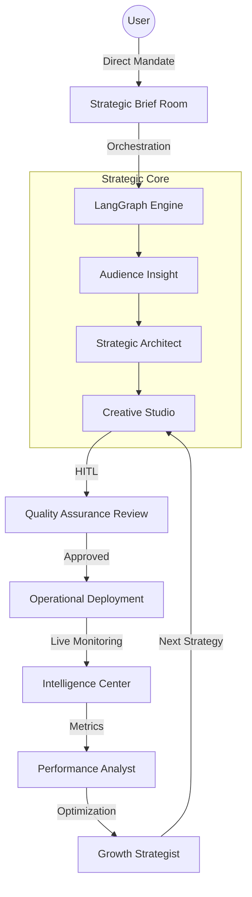

# 🚀 CampaignX — Strategic Campaign Studio

CampaignX is a premium, AI-powered campaign orchestration platform designed for the **CampaignX Strategic Labs**. It leverages a high-fidelity **5-agent LangGraph workflow** with Human-in-the-Loop (HITL) strategic review to architect, deploy, and optimize cross-segment marketing campaigns from a single natural-language mandate.

---

## 📐 Strategic Architecture



### Strategic Agent Command
| Phase | Domain | Objective |
|---|---|---|
| **Insight** | Audience Profiling | Enrichment of 1,000+ customer data points for granular targeting |
| **Strategy** | A/B Architecture | Mathematical derivation of high-yield customer segments and send windows |
| **Creative** | Content Engineering | Generation of subject lines and bodies with verified ML conversion hooks |
| **Analytics** | Performance Intelligence | Real-time intake of EC/EO metrics from the strategic deployment layer |
| **Growth** | Continuous Optimization | Bayesian loop to refine creativity based on live performance data |

---

## ⚡ Accelerated Setup (Docker)

### Prerequisites

- **Docker Desktop** (v4.20+)
- **Ollama** (Running on host machine)
- **Strategic Key** (Obtain from [Strategic Portal](https://campaignx.inxiteout.ai))

### 1. Initialization

```bash
git clone https://github.com/Hasan72341/CampaignAgenticAI.git
cd CampaignAgenticAI
cp .env.example .env
```

Edit `.env` with your team credentials and Ollama endpoint (use `http://host.docker.internal:11434` for Docker compatibility).

### 2. Operational Launch

```bash
# Ensure Ollama is serving the GLM-5 model
ollama run glm-5:cloud

# Start the command center
docker compose up --build -d
```

### 3. Access Command Layers

| Module | Access Link | Description |
|---|---|---|
| **Strategic Studio** | [http://localhost:5173](http://localhost:5173) | Primary Mandate & Review Interface |
| **Intelligence Center** | [http://localhost:5173/dashboard](http://localhost:5173/dashboard) | Live Performance & Orchestration Trace |
| **Strategic Labs** | [http://localhost:5173/settings](http://localhost:5173/settings) | Core Configuration & Security Ops |
| **API Blueprint** | [http://localhost:8000/docs](http://localhost:8000/docs) | Operational API Schemas |

---

## 🛠️ Command Center Features

### 📡 Strategic Capacity Tracking
The sidebar includes a live **Strategic Capacity** monitor. It tracks your operational orchestration limit against real system constraints using the backend analytics layer.

### 📋 Recent Mandate Vault
Access and pivot between your most recent campaign orchestrations directly from the HUD. Every mandate is persisted with its full strategic trace.

### 🔍 Orchestration Trace (Glass-Box Reasoning)
View the internal logic of the agents as they process your mandate. Every decision from profiling to content generation is logged with technical reasoning.

---

## 🧪 Operational Testing

### Automated E2E Flow
Validate your end-to-end connectivity including the 1,000 customer cohort fetch:

```bash
chmod +x test_flow.sh
./test_flow.sh
```

---

## 📄 License & Credits
Built by **Strategic Labs Team** for the CampaignX Global Hackathon.
